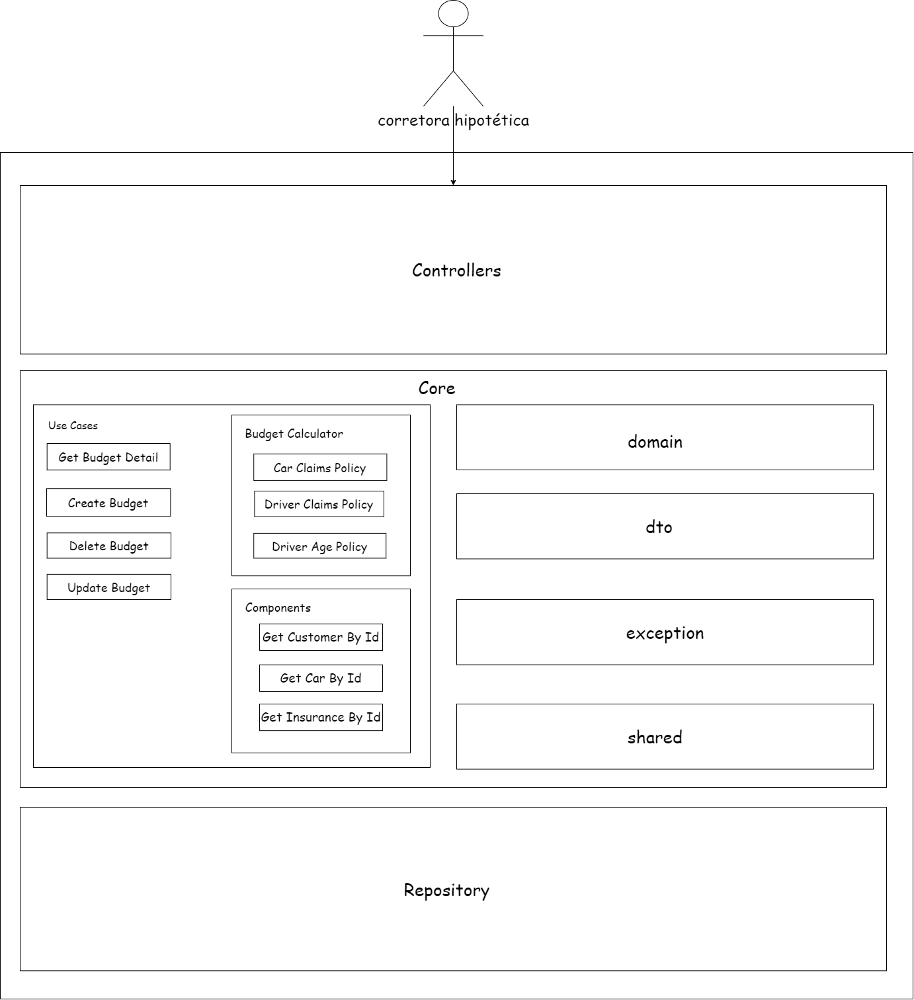

# Teste Técnico AUDSAT

Teste técnico para o processo seletivo para desenvolvedor backend da AUDSAT desenvolvido em Java 17 e Spring Boot 3.1.5.

## Arquitetura



## Deploy

O projeto está dockerizado e pode ser executado com o comando abaixo:

```bash
docker-compose up --build
```

## Swagger

Após o deploy, a documentação da API pode ser acessada através do link abaixo:

```
http://localhost:8100/insurance/swagger-ui/index.html
```

Também é possível consultar a documentação da API com especificação OPENAPI 3.0 no arquivo `./docs/api-docs.yml`.

